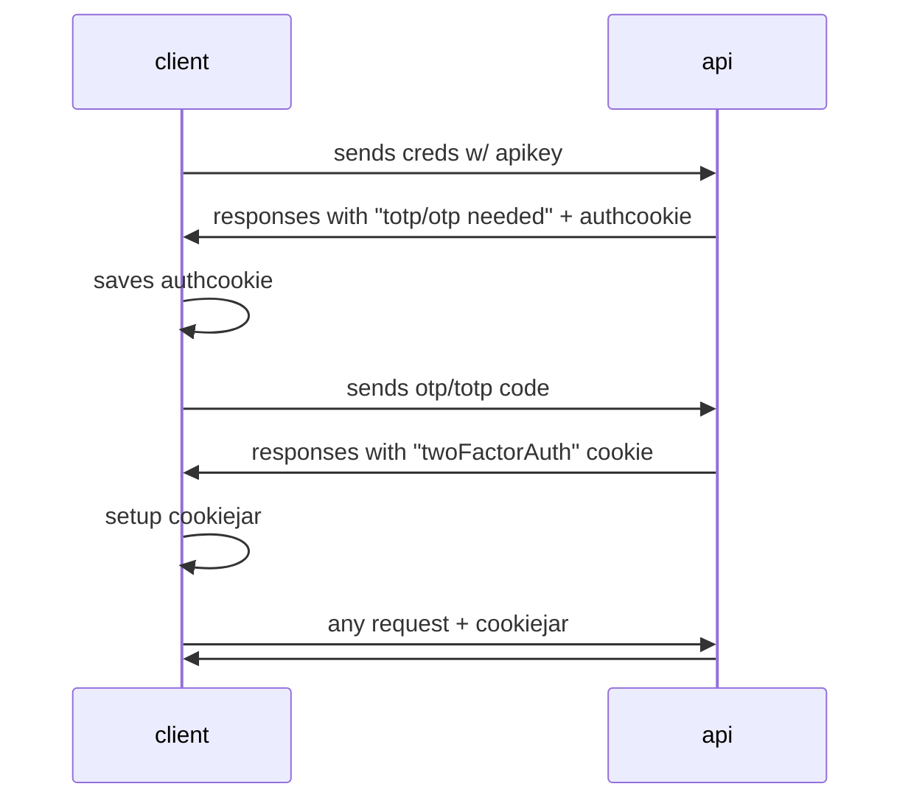

## How to get started

Set up your VRChat credentials on the file `.env.example`

by changing the default placeholder values with your own, then rename the file from `.env.example` to `.env`.

## Little explanation of how the VRChat login works

At first can be a little bit weird, and for this, I've created a Chart showing how the login works between the Client (our app) and the VRC API:

The thing to remember is that the VRChat "SDK" uses Axios under the hood, so we must use the default Axios instance that maps to the VRChat SDK one.

So any modification to the cookiejar in Axios, will affect the cookiejar in the VRChat SDK's Axios instance.

Also..

#### KEEP THIS IN MIND!!!

> **The cookies in the cookiejar are very powerful as it can be used to log in to the VRChat API, so keep it safe!**

For more information about the cookiejar and cookies in general and their use here, consult the comments on `vrchatAPI.ts`.

## Running test code
If you want to experiment with some code you added to `vrchatAPI.ts`, please add your testing code to this file:
> test/testZone.ts

To ensure that the main `vrchatAPI.ts` its kept clean.

## Example code to get comfy with the login process
We've provided you with an example file for testing and learning how the login process works, in two ways: A simple one and a manual one.

You can find the example file is in `example/showFriends.ts`
