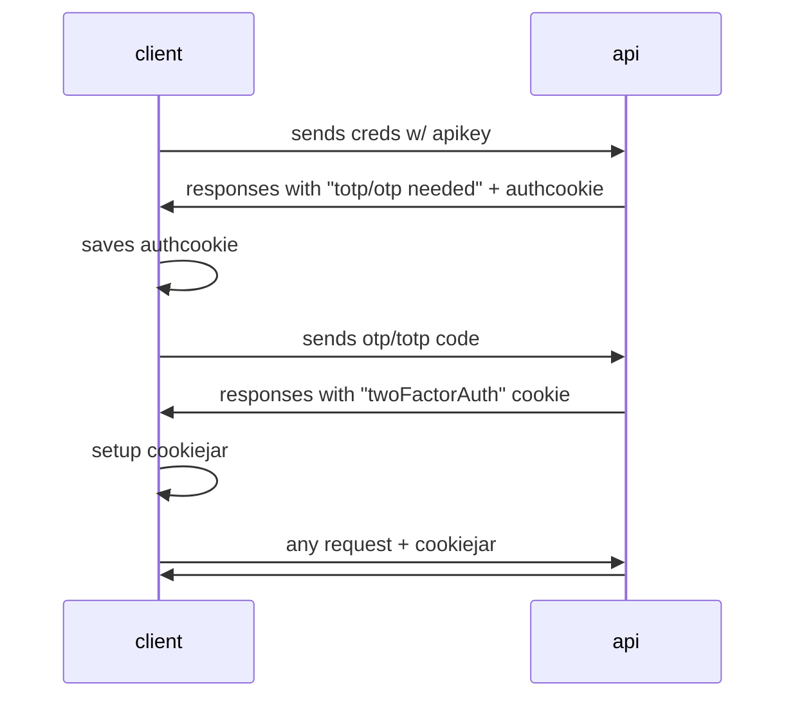

```mermaid
graph TD;
    A-->B;
    A-->C;
    B-->D;
    C-->D;
```

```mermaid
sequenceDiagram
    participant client
    participant api
    client->>api: sends creds w/ apikey
    api->>client: responses with "totp/otp needed" + authcookie
    client->>client: saves authcookie 
    client->>api: sends otp/totp code
    api->>client: responses with "twoFactorAuth" cookie
    client->>client: setup cookiejar
    client->>api: any request + cookiejar
    api->>client: 
    
```

